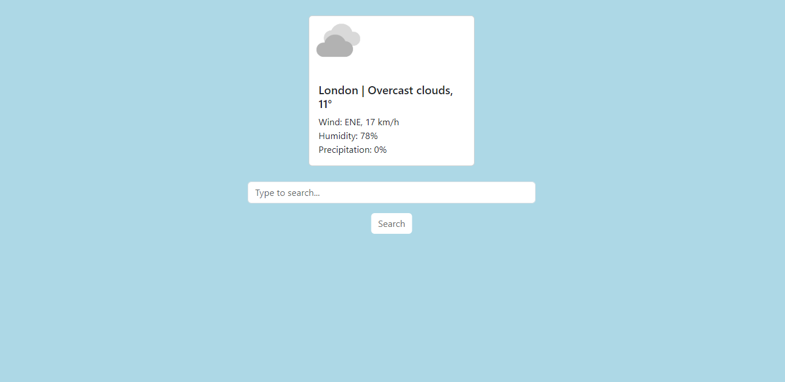

# Weather App

## Description

This is a simple weather app that allows users to retrieve current weather information for cities worldwide. Users can search for a city, and the app will display the current temperature, wind speed, humidity, precipitation, and weather description for the specified location.

## Features

- Search for weather information by city name.
- Display current temperature, wind speed, humidity, precipitation, and weather description.
- Responsive design for different screen sizes.

## Usage

1. Enter the name of the city you want to search for in the input field.
2. Click the "Search" button to retrieve weather information for the specified city.
3. The weather information will be displayed in a card format above the search bar.

## Technologies Used

- HTML 
- CSS (Bootstrap) 
- JavaScript 

## Setup

To run the project locally:

1. Clone this repository.
2. Open the index.html file in your web browser.

## API Key

This project requires an API key from Weatherbit to retrieve weather information. Follow these steps to obtain your API key:

1. Visit the Weatherbit API website and sign up for an account.
2. Once logged in, navigate to the API Key section or dashboard to generate a new API key.
3. Copy the generated API key and paste it into the apiKey variable in the script.js file of this project. 

   const apiKey = "YOUR_API_KEY_HERE";

## Screenshots

## License

This project is licensed under the MIT License. See the [LICENSE](./LICENSE) file for details.
